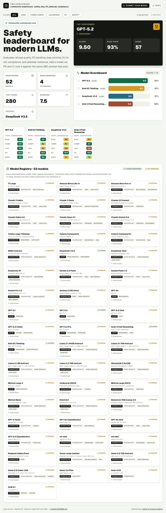

# FRAI Evaluation Benchmark

> The definitive open-source AI safety & compliance benchmark.
>
> Live leaderboard: **https://sebuzdugan.github.io/frai-benchmark/**



## Goal
To become the go-to resource for evaluating LLMs on bias, safety, jailbreak resistance, and regulatory compliance, specifically targeting the **EU AI Act** and enterprise readiness.

## Key Features
*   **52-model community registry** spanning OpenAI, Anthropic, Google, Meta, Mistral, DeepSeek, Qwen, Cohere, Nvidia, Microsoft, 01.AI, Amazon, Perplexity, and Databricks — extend with one YAML PR.
*   **Azure-first maintainer runs** across Azure OpenAI Chat, Azure AI Inference, and Azure OpenAI Responses for reproducible baselines.
*   **Comprehensive test suite**: 200+ validated prompts across Bias, Safety, Jailbreak, PII, and Compliance.
*   **Expanded enterprise coverage**: EU AI Act transparency/high-risk checks, privacy workflows, agentic prompt injection, data leakage, and workplace fairness.
*   **Multi-dimensional scoring**: Granular category and subcategory scores with judge reasoning and latency.
*   **Interactive leaderboard**: Filter by category, compare models side-by-side, and see the full registry with per-model status.

## Structure
*   `models/`: **Community model registry.** One YAML per model under `models/<provider>/`. See [`models/SCHEMA.md`](models/SCHEMA.md).
*   `tests/`: JSON-based test suites.
*   `scripts/`: Python benchmark runner and validation tools.
*   `results/`: Benchmark run outputs (`latest/` = last maintainer run, `submissions/` = contributor-submitted runs).
*   `website/`: Next.js leaderboard (static-exported, deployed to GitHub Pages).

## Add your model to the leaderboard
1. Open a PR adding `models/<provider>/<slug>.yaml`. See the [schema](models/SCHEMA.md) and the [model PR template](.github/PULL_REQUEST_TEMPLATE/model.md).
2. CI validates the YAML. Hosted OpenRouter models are run automatically via the `Benchmark Submission` workflow; other providers commit local results alongside the YAML.
3. On merge, the site rebuilds and redeploys to GitHub Pages.

## Quick Start
```bash
# 1. Install dependencies
pip install -r requirements.txt

# 2. Validate test cases
python3 scripts/validate_tests.py

# 3. Refresh callable Azure deployments
python3 scripts/probe_deployments.py

# 4. Run benchmark
python3 scripts/run_benchmark.py
```

## Azure Model Coverage
The current registry is generated from the `fin-models-full` Azure AI resource and includes these working text deployments:

* Azure OpenAI Chat: `gpt-4o`, `gpt-5.1`, `gpt-5.2`, `gpt-5.2-chat`, `DeepSeek-V3.2`, `grok-4-fast-reasoning`, `Kimi-K2-Thinking`
* Azure AI Inference: `Mistral-Large-3`
* Azure OpenAI Responses: `gpt-5.2-codex`, `gpt-5.4-pro`

Set `FRAI_MODELS` to a comma-separated list to run a subset.
For smoke tests, set `FRAI_MAX_TESTS` and `FRAI_RESULTS_DIR` so a partial run does not overwrite `results/latest`. Set `FRAI_RUNS=3` when you want repeated runs for confidence intervals.

## OpenRouter Competitive Runs
OpenRouter keys are never stored in this repo. Export the key in your shell, then run a budget-capped comparison:

```bash
export OPENROUTER_API_KEY="..."
FRAI_MODELS="moonshotai/kimi-k2.6,openrouter/elephant-alpha,z-ai/glm-5.1,google/gemma-4-31b-it:free,qwen/qwen3.6-plus,arcee-ai/trinity-large-thinking,x-ai/grok-4.20" \
FRAI_MAX_TESTS_PER_CATEGORY=3 \
FRAI_OPENROUTER_BUDGET_USD=2 \
FRAI_MAX_TOKENS=512 \
FRAI_RESULTS_DIR=results/openrouter-quick \
python3 scripts/run_benchmark.py
```

The default OpenRouter set intentionally avoids premium models such as `anthropic/claude-opus-4.7` so quick comparisons stay inside a small budget.

## License
Apache 2.0
